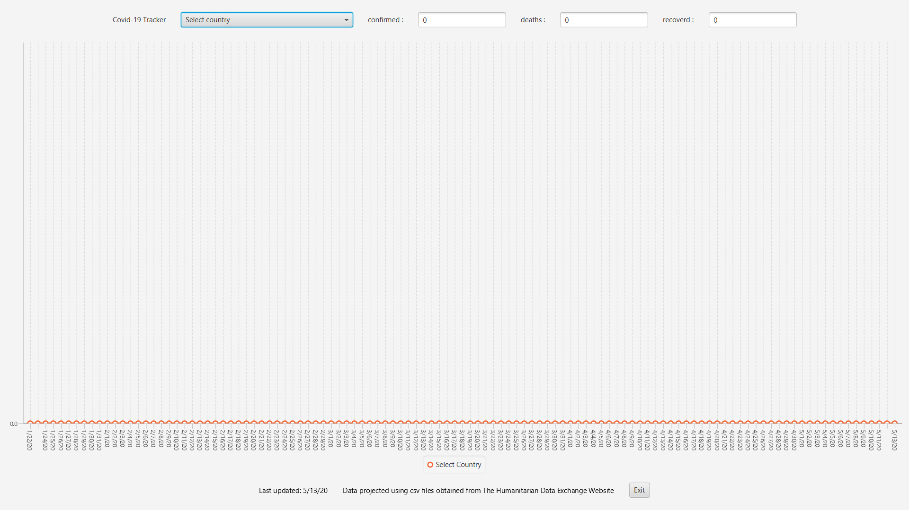
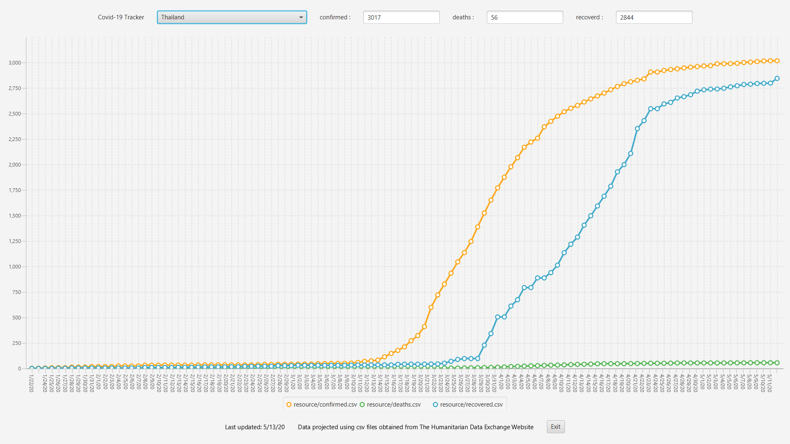

# pa4-Sahanon-P Covid-19 tracker

The app that will show the line graph of the Covid-19 confirmed infected,death and recoverd from all the country in the world.

<p align = "center">
    
</p>

## Requirement

>This applications require java 11 (or above) due to some method that not include in the lower versions

**before using the programm add this library in to your dependencies**

1.javafx - can download from any website or https://gluonhq.com/products/javafx/  

2.opencsv - already have in the `/lib` in repositories

## Features

<p align = "center">
    
</p>

Download the csv file from the website

Can choose the country to see the linechart of the infected, deaths and recoverd

Show the total number of the infected, deaths and recoverd

Provide the app in the fullscreen mode for easy to read 

## How to download

1. Clone or download this repositories

2. open file App.java

3. run the programm

## Configurations

In vscode you need to set the vmArgs before running the java fx

**How to set the vmArgs**

1.open the command pallete and search for launch.json

2.look for the configuration of your file
```yml
    "type": "java",
    "name": "CodeLens (Launch) - App",
    "request": "launch",
    "mainClass": "src.App",
    "vmArgs": "--module-path //javafx path// --add-modules javafx.controls,javafx.fxml",
    "projectName": "Assign4_920bb74d"
```
3. set the vmArgs as the sample above

